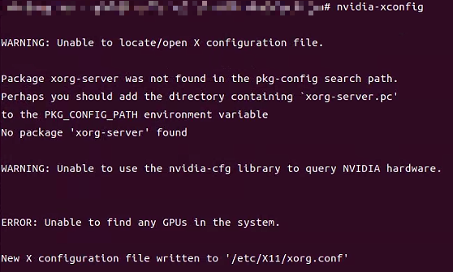
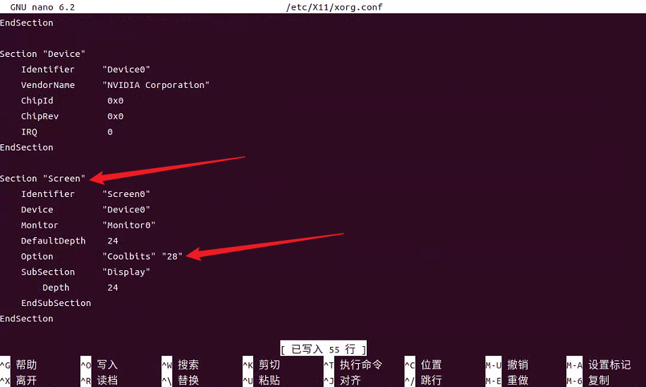
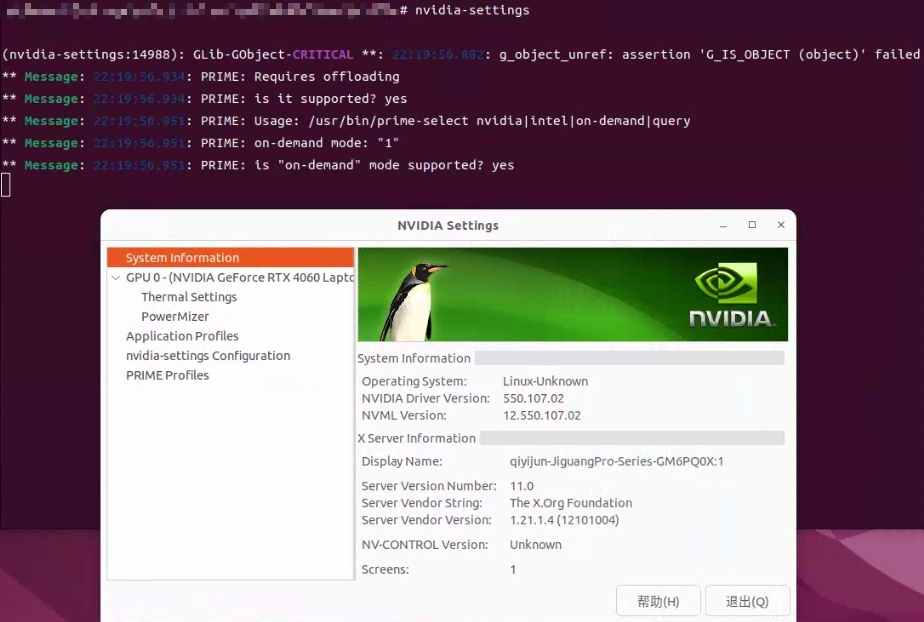
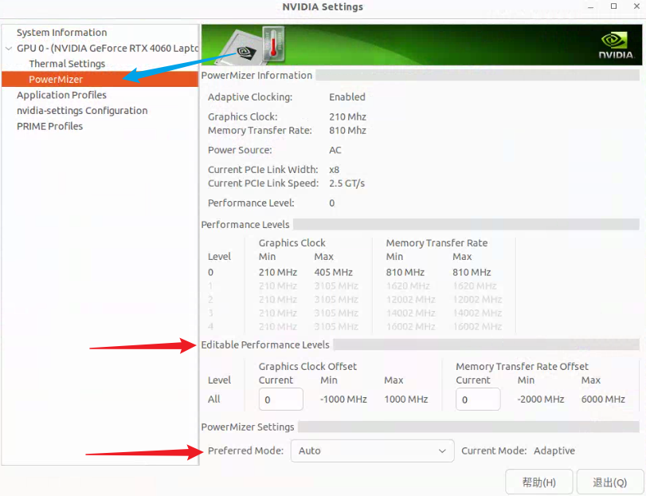
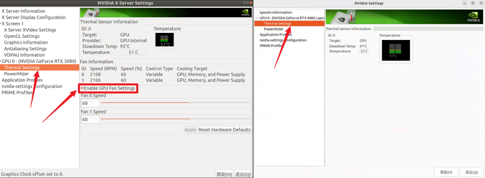

# 本篇是 Ubuntu 系统下的显卡超频教程
打开终端，输入
```
sudo nvidia-xconfig
```

此时会在 `/etc/X11` 中生成 `xorg.conf` 文件，就像下面这样</br>


打开和编辑这个文件
```
sudo nano /etc/X11/xorg.conf
```
在图中的位置添加下面这段内容（我的配置文件是在最后面），开启显卡风扇转速调整和显卡超频
```
Option "Coolbits" "28"
```


然后重启 `reboot`

打开终端，输入
```
nvidia-settings
```
即可打开 `NVIAID Settings` ，如下图所示


左侧打开 `GPU ... -> PowerMizer` 即可看到超频界面</br>
你可以选择自主超频，也可以直接选择底下的预设模式 `Preferred Mode`
```
Graphics Clock Offset    Memory Transfer Rate Offset
超核心

```
| Graphics Clock Offset          | Memory Transfer Rate Offset                         |
| ------------------------------ | --------------------------------------------------- |
| 超核心                         | 超显存                                              |
| 个人建议是以 50 的跨度进行超频 | 个人建议开始可以写1000，此后尝试 100 的跨度进行超频 |


如果需要调整显卡风扇转速，在左侧打开 `Thermal Settings`
因为我的是笔记本，所以不能够在这里调整风扇转速，有需要的可以自行搜索 `coolgpus`


经过测试，本人的 RTX 4060 Laptop 可超参数如下</br>
我的最高参数，还能往上超，不敢继续超，怕坏了
<table>
  <tr>
    <td colspan="2" align="center"  ><b>我的最高参数，还能往上超，不敢继续超，怕坏了</b></td>
  </tr>
  <tr>
    <td>Graphics Clock Offset</td>
    <td>Memory Transfer Rate Offset</td>
  </tr>
  <tr>
    <td>300</td>
    <td>1500</td>
  </tr>
  <tr><td colspan="2"></td></tr>
  <tr>
    <td colspan="2" align="center"  ><b>我的最稳定参数，最舒服参数</b></td>
  </tr>
  <tr>
    <td>Graphics Clock Offset</td>
    <td>Memory Transfer Rate Offset</td>
  </tr>
  <tr>
    <td>255</td>
    <td>800</td>
  </tr>
</table>

超频后算力有所提升，但不要想得太高，通常也就是提升 `10%~20%`