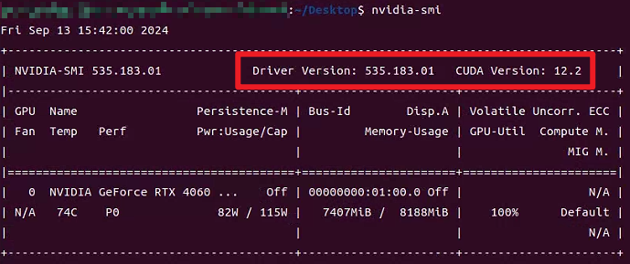
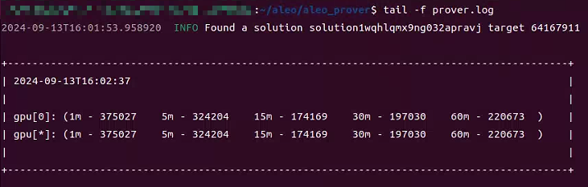
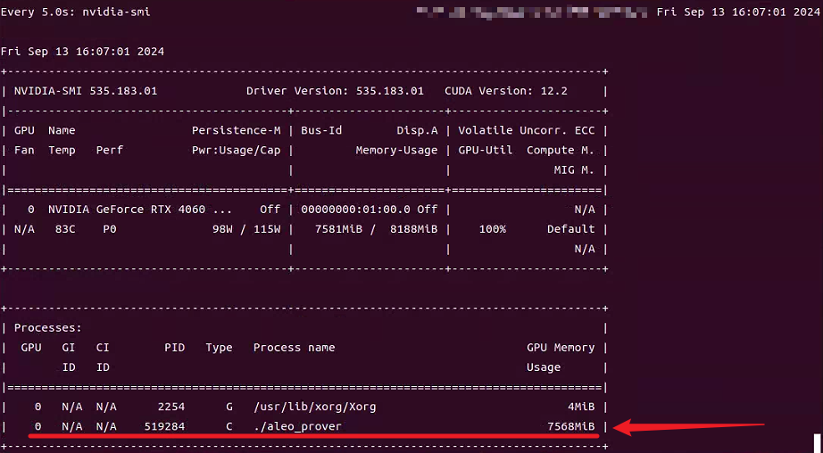

# 介绍
这是一个 从零开始 Ubuntu 部署 [zkwork_aleo_gpu_worker](https://github.com/6block/zkwork_aleo_gpu_worker/blob/master) 的教程 <== 你可以点击蓝色文字了解 zkwork_aleo_gpu_worker</br>
我在 Ubuntu 上部署的过程中，较难的部分就是安装驱动，Ubuntu 上安装驱动要比 Windows 上难一些，但是不用担心，我将会一步步的带你安装，如果你有疑问，点这里提交 [issue](https://github.com/QiYiJun/zkwork_aleo_ubuntu_tutorial/issues/new)

# 系统与驱动版本
- 系统：Ubuntu 22.04
- NVIDIA 显卡驱动：535.183.01（或以上）
- CUDA Toolkit ：12.2（或以上）

# 安装
- ## 系统
  如果你不会安装 Ubuntu 系统，那就去 [哔哩哔哩](https://www.bilibili.com/) 或者 [YouTube](https://www.youtube.com) 观看相关教程</br>
  我有时间的话会给大家制作图文教程与视频教程 (挖大坑)</br>
  <b>Ubuntu 镜像站</b>
  - [官网](https://ubuntu.com/download/desktop)
  - [网易](http://mirrors.163.com/ubuntu-releases/)
  - [阿里云](http://mirrors.aliyun.com/ubuntu-releases/)
  - [浙江大学](http://mirrors.zju.edu.cn/ubuntu-releases/)
  - [<del>北京理工大学</del>](http://mirror.bit.edu.cn/ubuntu-releases/)（已失效）
  - [中国科技技术大学](http://mirrors.ustc.edu.cn/ubuntu-releases/)

- ## NVIAIA 显卡驱动 + CUDA Toolkit

  ### 更新软件列表和安装必要软件、依赖
  ```
  sudo apt-get update
  sudo apt-get install gcc-12 g++-12 make
  ```

  ### 禁用默认驱动
  打开`blacklist.conf`
  ```
  sudo nano /etc/modprobe.d/blacklist.conf
  ```
  或者新建`blacklist-nouveau.conf`文件
  ```
  sudo nano /etc/modprobe.d/blacklist-nouveau.conf
  ```
  写入内容并保存
  ```
  blacklist nouveau
  options nouveau modeset=0
  ```

  ### 更新initramfs镜像文件
  ```
  sudo update-initramfs -u
  ```

  ### 重启电脑`reboot`，然后在终端输入
  ```
  lsmod | grep nouveau
  ```
  如果没有输出内容就说明已经禁用了nouveau

  ### 安装 NVIDIA驱动 和 CUDA Toolkit
  ```
  sudo apt install nvidia-driver-535 nvidia-dkms-535 nvidia-cuda-toolkit
  ```
  输入`nvidia-smi`，如果出现下述界面，并包含 NVIDIA驱动 和 CUDA 的版本号，就说明安装成功了
      

- ## 部署 zkwork_aleo_gpu_worker
  ### 下载 zkwork miner 并解压
  ```
  wget https://github.com/6block/zkwork_aleo_gpu_worker/releases/download/v0.1.1/aleo_prover-v0.1.1.tar.gz
  tar -zvxf aleo_prover-v0.1.1.tar.gz
  cd aleo_prover
  ```

  ### 打开并更新 `run_prover.sh` 文件内容
  Tips：如果你使用的系统带desktop，可以找到文件并双击打开进行编辑，这样会比较方便</br>
  下面是模板，删掉原来的内容，复制粘贴这个模板，你需要更新的内容是 `reward_address` 和 `custom_name`</br>
  你可以选择使用这些钱包 [foxwallet](https://foxwallet.com/), [leowallet](https://www.leo.app/), [puzzle wallet](https://puzzle.online/)
  ```
  # server list
  pool=aleo.hk.zk.work:10003

  # use your own aleo reward_address
  reward_address=钱包地址

  # set your own custom name
  custom_name="随便取一个英文名确保唯一"

  # Check if aleo_prover process exists and kill it if running
  if pgrep aleo_prover > /dev/null; then
      pgrep aleo_prover | xargs kill
  fi

  # Start the aleo_prover in background and log output
  nohup ./aleo_prover --address $reward_address --pool $pool --custom_name $custom_name >> prover.log 2>&1 &
  ```

  ### 开始矿工之旅
  首次运行
  ```
  sudo chmod +x run_prover.sh && ./run_prover.sh
  ```
  非首次运行
  ```
  ./run_prover.sh
  ```

  ### 查看日志
  不确定矿工程序是否运行，请查看日志
  ```
  tail -f prover.log
  ```
  正常运行的日志是这样子的</br>
  

  也可以通过查看GPU占用来判断矿工程序是否正常运行
  ```
  watch -n 5 nvidia-smi
  ```
  
